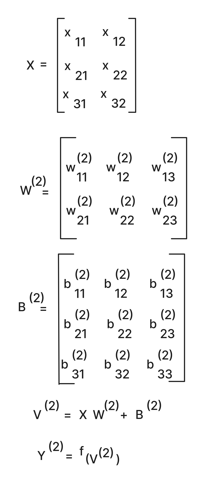
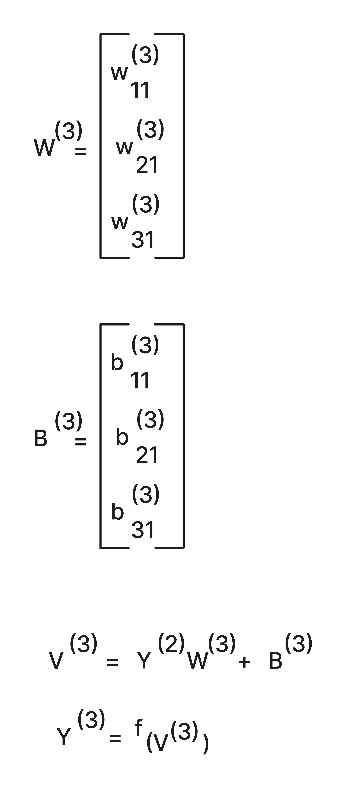
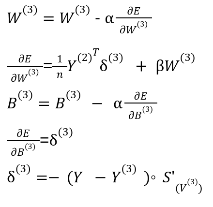
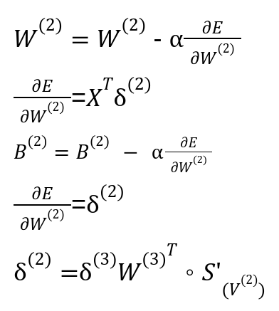
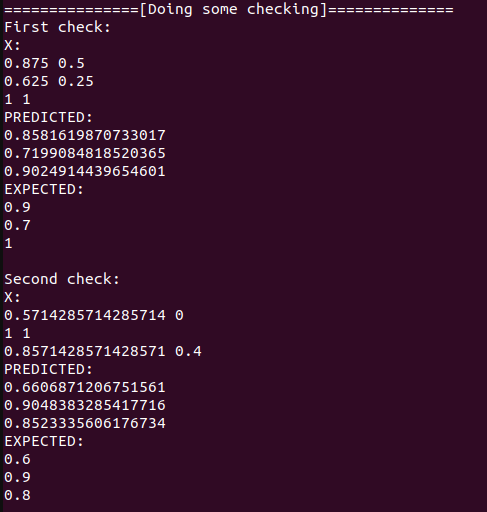
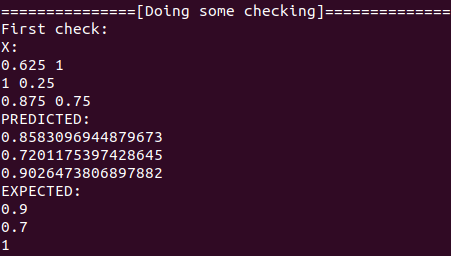

# Supervised machine learning

This repository has the implementation of a Neural Network to solve an imaginary problem of a student trying to predict his linear algebra test score based on the amount of hours of sleep and meditation - yes, no studying here :)

If you just crashed on this repo you can understand all the idea by [reading my article](https://www.buarki.com/blog/ml-supervised-learning) where I explain in baby-steps how supervised machine learning works and how to build the main components of it with the mathematical details.


# The neural net topology


The image above shows the neural network topology. Grey balls represent input neurons, yellow ones represent the weights of the second layer, the green one represents the bias of the second layer, the blue represents the weight of the third layer, and red represents the bias of the third layer.

# The forward process

For the second layer, the forward computations are the following:




For the third layer, the forward computations are the following:



# The backward process

For the third layer, the backward computations are the following:



For the second layer, the backward computations are the following:



# Running it

## Requirements
- have go >=1.19 installed.

## Running
```sh
go get all
go run *.go
```

## Some outputs after training





Above images show some predictions after the training, not so bad :)

# Some larnings from implementing it

- Always normalize data!
- TDD can be handy specially to test if the computations of forward and backward process are correct;
- Defining a good learning rate is not trivial;
- It takes time to train the Neural Net :)
- Implementing a neural network is probably not needed for the vast majority of cases and "ready" tools like TensorFlow might do the job;

# For nitpickers

- The topology of the neural network used here was designed to be simple as it is and it has **no intentions at all of being extended, modified, or incremented...**... It will just remain like that forever. So, in case you are getting mad with a method name "computeLayer3Params" thinking "computeLayer3Params is not scalable, what if we have 4 or 5 layer?", it will just not happen, take a chill pill :)
- This project is really simple as it is to make it easy for newcomers in this area or curious people get the idea of how it works. If you are an expert dealing with ML on a daily basis, it may indeed seem trivial, and that's exactly the point :)

# Contributions
Did you find some bug? Know how to improve something? Nice! Feel free to open a pull request. All contributions are welcome :)
